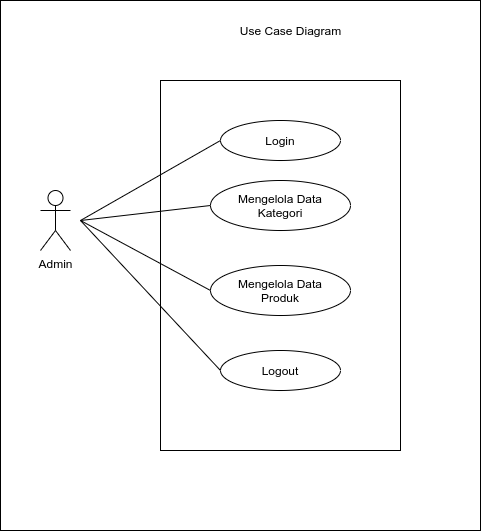

## Aplikasi test case full stack di PT Majoo Teknologi Indonesia

### file Database : db_test_case_fullstack
### download vendor : composer install
### agar storage bisa diakses public : php artisan storage:link 

#
#

## ERD

#
#
## Use Case Diagram

#
#
## Activity Diagram

#
#
## Data Manipulation Language

### Category
* SELECT * FROM categories
* SELECT * FROM categories WHERE id = ?
* INSERT INTO categories VALUES id, name
* UPDATE categories SET name WHERE id = ?
* DELETE FROM categories WHERE id = ?

### Product
* SELECT * FROM products
* SELECT * FROM products WHERE id = ?
* INSERT INTO products VALUES id, name, category_id, price, description, image
* UPDATE products SET name, category_id, price, description, image WHERE id = ?
* DELETE FROM products WHERE id = ?

### Join Product dengan Category
* SELECT * FROM products JOIN categories ON categories.id = products.category_id

* SELECT * FROM products JOIN categories ON categories.id = products.category_id WHERE products.id = ?